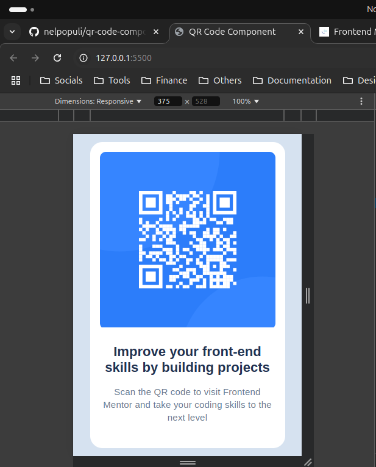
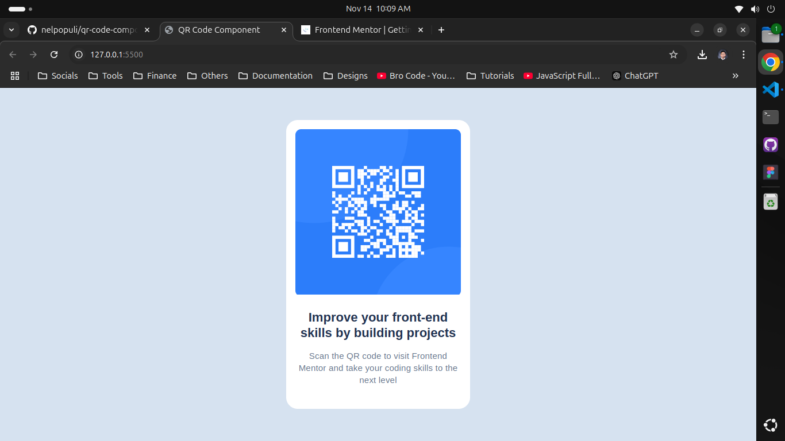

# Frontend Mentor - QR code component solution

This is a solution to the [QR code component challenge on Frontend Mentor](https://www.frontendmentor.io/challenges/qr-code-component-iux_sIO_H). Frontend Mentor challenges help you improve your coding skills by building realistic projects.

## Table of contents

- [Overview](#overview)
  - [Screenshot](#screenshot)
  - [Links](#links)
- [My process](#my-process)
  - [Built with](#built-with)

## Overview

### Screenshot

### Links

- Live Site URL: [Github Page](https://nelpopuli.github.io/qr-code-component/)

## My process

### Steps

1. Analyzed the Figma design for accurate layout.
2. Structured HTML with semantic elements.
3. Applied CSS and custom properties for styling.
4. Used Flexbox for responsive layout.
5. Final adjustments and styling tweaks based on Figma.

### Built with

- Semantic HTML5
- CSS custom properties
- Flexbox
- Mobile-first workflow
